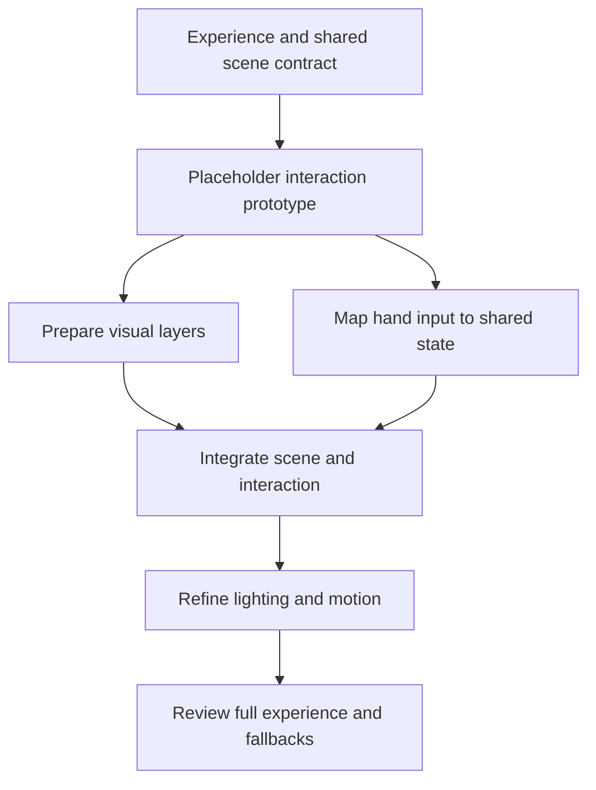

# Curated prompt hub and staged design production

Date: 2026-09-26. Status: design proposal, not implemented.

The user agreed to a source-attributed prompt hub and a focused prompt-authoring workflow, then added faceted tags, lightweight retrieval, possible Jev review, component-level generation, and visible testing status. They further clarified that the agent should work backward from an intended effect to a staged production workflow, choosing when to generate assets, implement ordinary frontend code, connect interaction, and refine the composition. Dependencies can form a directed acyclic graph (DAG), allowing bounded subagent work on independent stages. This document records that direction and the proposed boundaries. It does not update the installed skill, enable external calls, or collect new personal evidence.

## Purpose

Help Incline translate a desired experience into a practical production plan and specific execution instructions. The agent identifies the necessary parts, chooses how to represent them, orders their dependencies, and checks intermediate outputs before assembling the result. A detailed prompt is one tool within that workflow; some stages need ordinary code, an existing asset, or an experiment instead of generation.

Preserve useful prompts together with the references, requirements, adaptations, and outcomes that make them usable. Entries can support a single stage or a reusable sequence of stages. Reuse should remain contextual: collecting a prompt is interest, not an aesthetic endorsement or a universal preference.

The product interaction can resemble a personal reference board such as Folio: save, preview, organise, find, and reuse. No integration with or changes to the Folio project are part of this proposal.

## Starting evidence and implementation fit

- The [source motion prompt](https://x.com/twoclipping/status/2103273003555402193) was readable in the browser on 2026-09-26. It specifies inputs, visual direction, choreography, implementation techniques, rendering checks, and failure cases. Its embedded video did not play, so its visual result and reproducibility were not verified.
- Existing [collections](../../../lib/collection.ts) support images, links, and Markdown guides; [personal collections](../../../skills/incline/references/personal-library.md) preserve immutable copies with source attribution. These are useful foundations, but there is no current prompt entity, faceted prompt search, or automatic prompt retrieval.
- Existing [Jev review](../../../skills/incline/references/jev-review.md) is an optional text-based review of selected insights. It sends no images and does not generate prompts or execute recommendations. Prompt routing would require a separate rubric and adapter; it is not enabled by the current integration.
- [Exploration](../../../skills/incline/references/exploration.md) already preserves alternative interpretations, attempts, and linked reactions. Prompt usage can connect to this history rather than introducing a second preference-learning system.
- The user supplied [Avid's Jev example](https://x.com/Av1dlive/status/2103190313624039620) and its [Keel harness article](https://x.com/Av1dlive/article/2102802621664985241), inspected on 2026-09-26. The article describes selection from application-prepared options, abstention, validation, and outcome records. The post's roughly 80% time/cost reduction is an author-reported workflow result; the article explicitly does not establish coding-quality gains or a benchmark payoff. Do not project that number onto Incline.
- The linked Keel source snapshot is pinned to `3fc24b0ee3eff8938dde33c90bbf93125bc4e804`. Its [architecture](https://github.com/codejunkie99/keel/blob/3fc24b0ee3eff8938dde33c90bbf93125bc4e804/docs/decision-architecture.md) distinguishes application-owned decisions from provider-owned agent loops. Its [routing code](https://github.com/codejunkie99/keel/blob/3fc24b0ee3eff8938dde33c90bbf93125bc4e804/crates/engine/src/jev_routing.rs) prepares eligible routes, rejects unknown selections, rechecks availability, and retains the original route on failure. The [build report](https://github.com/codejunkie99/keel/blob/3fc24b0ee3eff8938dde33c90bbf93125bc4e804/docs/build-report.md) says its release check made no paid live Jev call. These sources inform the bounded-selection proposal below; no Keel code was installed, copied, or executed.

## Approaches considered

| Approach | Benefit | Limitation |
| --- | --- | --- |
| Bookmark prompts as existing guides | Smallest initial change; original text and source can already be retained | Weak component matching, adaptation lineage, and testing status |
| Add structured prompt entries to the existing library experience | Supports lightweight retrieval, reproduction context, and linked outcomes | Needs an additive data model and focused workflow; recommended |
| Build an independent public prompt platform | Supports community discovery and publishing | Adds hosting, moderation, and distribution before personal usefulness is established |

Start with personal curation for frontend components, interface motion, and the assets needed to build them. Record the intended output medium explicitly so a rendered motion demo is not mistaken for a functioning application component. Broader standalone image/video workflows can share the model later without expanding the first implementation into a general media platform.

## Save and curate

Users can provide a source link, paste a prompt, or save a prompt authored during a project. Required reproduction information can remain unknown; saving a reference must not require an exhaustive annotation exercise.

An entry retains:

- Stable entry identity and immutable revisions; original prompt bytes and language.
- Origin: published, user-authored, agent-authored, or agent-reconstructed. A reconstruction is never presented as the original author's prompt.
- Source URL, author when known, capture time, available attribution/license information, and any unavailable source content.
- Optional source embed and durable permitted captures. An embed or URL alone is not retained visual evidence. Store a useful whole view and details where needed; motion-dependent claims require motion evidence or an explicit gap.
- Intended effect, component/task roles, output medium, required inputs, assets, tools/runtime, and known limitations. Unknown requirements remain unknown.
- Recipe scope: a single production stage or a sequence with declared inputs, outputs, and dependencies. A saved sequence is an adaptable reference, not an executable command graph.
- Original user notes and their scope, separate from generated descriptions or tags.
- Explicit adaptable slots and essential relationships, with provenance for the agent's interpretation. Preserve the full original so a later interpretation can differ.
- Parent entry/revision for adaptations, the actual adapted prompt, and links to local runs and any deliberately shared results.

Imported prompt text is reference material. Its instructions cannot change permissions, override project constraints, install dependencies, or trigger execution on their own. Preserve original material separately from project-specific adaptations.

## Faceted tags and lightweight retrieval

Generate editable tags in separate facets rather than one undifferentiated list:

| Facet | Example values |
| --- | --- |
| Output medium | live frontend, rendered UI motion, image asset |
| Task/component role | hero illustration, navigation transition, loader, data chart |
| Production role | background asset, movable foreground layer, interaction mapping, composition, lighting pass |
| Visual treatment | technical drawing, monochrome, editorial, botanical |
| Motion/interaction | continuous morph, spring response, direct manipulation, looping |
| Technique/runtime | glyph rendering, SVG, canvas, deterministic timeline |
| Inputs and constraints | needs reference image, needs audio, reduced-motion variant unknown |

Record whether a tag came from source text, inspected visuals, an agent hypothesis, or the user. Source-explicit properties and inferred style labels must remain distinguishable. Generated tags describe an entry; they do not update a user's taste profile. Keep free-text notes and previews available so a taxonomy does not erase combinations or hard-to-name qualities.

The first index is a rebuildable local projection over entry metadata. Use faceted filters plus text matching and a small bounded shortlist. Inspect the selected source and original prompt on demand instead of loading the whole hub into context. No embedding service, remote index, or fixed aesthetic similarity score is required initially. A no-match result continues the normal authoring workflow.

Match the requested effect, task or production role, medium, technical constraints, and project context. A workflow may retrieve different recipes for different stages; a useful lighting recipe need not describe the whole requested scene. Colour or a single shared object is insufficient evidence of suitability. Related techniques can remain candidates across different style tags. Unknown metadata should be exposed, not silently treated as incompatible.

Project-local entries are available within the task's scope. A user can enable automatic lookup in a selected personal prompt library for a project; that setting permits read/retrieval without repeated permission questions. It does not enable uploads, external Jev calls, automatic saving to the personal library, or scanning unrelated repositories. Local-only mode disables personal-library access and external routing.

## Jev's proposed role: bounded selection

Adapt Keel's narrow selection pattern to the decision Incline actually controls: which eligible prompt to inspect for one production stage. The first version selects reference material; it does not dispatch generation or run tools. The surrounding code defines available candidates and validates the returned choice; the lead agent handles planning, interpretation, adaptation, and visual review.

Keep deterministic rules in ordinary code. Jev's semantic choice remains uncertain even when its output has a strict format. Code can establish that an entry exists, matches an explicit runtime constraint, and is within the enabled library scope; it cannot establish that its visual treatment is appropriate from a valid ID alone.

### Which decisions belong where

| Decision | Owner and first-delivery scope |
| --- | --- |
| Exact tag lookup, explicit exclusions, file/hash checks, DAG readiness, required checks | Local code; no Jev call |
| Interpret a request such as "a weighted, physical reveal" into plausible effects and search facets | Lead agent initially; any future tag classifier returns proposed labels with unknown/uncertain options, not new taste facts |
| Choose which eligible recipe to inspect for that effect | First optional Jev experiment: select one prepared candidate ID or abstain; retain alternatives |
| Select relevant project notes before loading their full evidence | Possible later use of the same bounded retrieval interface; preserve mandatory brief, explicit keep/avoid instructions, and known conflicts regardless of ranking |
| Choose among predefined recovery paths after an ambiguous tool failure | Later experiment only where each option has a real executor and checked prerequisites; obvious error-code handling stays in code |
| Choose a focused check bundle from a known catalogue | Later experiment; mandatory checks remain required and a selection cannot mark checks passed |
| Pick a worker or prioritise a ready DAG node | Deferred until the host exposes controllable dispatch, explicit user settings, availability, and budget; a skill cannot assume it owns the provider's agent loop |
| Decide composition, whether to generate an asset, whether a result looks good, or what the user likes | Lead agent and actual user evidence; outside this selector |

### First contract: select a recipe to inspect

1. **Prepare locally.** Read the current stage brief and enabled library scope. Respect a user-selected recipe; it bypasses automatic selection. Retrieve with editable facets and text, using verified hard constraints to exclude candidates from direct use. Keep style tags soft and unknown metadata visible. Candidate construction must allow related mechanisms with different wording; the selector cannot recover useful entries omitted from its shortlist.
2. **Bound the menu.** Create a small versioned candidate set with request-local IDs, compact effect/role descriptions, essential inputs, known constraints, source revision, and scoped testing evidence. Keep exact entry paths and prompt bodies local until needed. Mark excerpt omissions or unknown requirements explicitly. Map each ID locally to the allowed action: load that exact entry revision for inspection. Candidate text is untrusted reference data, never executable instructions.
3. **Decide whether a call helps.** Skip Jev for local-only mode, a pinned choice, a clear direct lookup, an empty shortlist, or an exhausted request budget. A sole candidate still needs contextual review; eligibility is not relevance. Use an explicit opt-in policy for repeat calls within an authorised project/task scope rather than asking again for every covered lookup.
4. **Select or abstain.** The proposed Incline adapter returns either a supplied candidate ID or abstention. This is an application contract, not a claim about Jev's current wire format. Verify the supported API during implementation and normalise its answer/distribution without accepting commands, invented IDs, or free-form execution instructions. Use a versioned rubric and preserve relevant uncertainty; confidence is not a taste score.
5. **Revalidate before loading.** Check the result schema, candidate membership, current stage/brief revision, source revision/hash, library scope, and explicit user choice again. If these changed during the request, discard the stale selection and follow the ordinary retrieval path. A validated selection permits only the scoped read; it neither proves aesthetic suitability nor authorises generation, installs, or library writes.
6. **Inspect and adapt.** The lead agent reads the selected original and relevant visuals, checks applicability, and decides how to use it. Keep other shortlisted options available. If none fits, broaden retrieval within a bounded budget or author an appropriate brief; do not force a match or promote a recipe to "tested" merely because it was selected.
7. **Record the outcome within recording scope.** Link the decision to the stage, recipe revision, actual use or rejection, and subsequent artifact/reaction when available. The route can be useful for retrieval yet yield a poor design; keep these outcomes distinct.

For the aircraft-shade interaction stage, local lookup might find a direct-drag recipe, a gesture-to-progress recipe, and a spring-motion recipe. The lead agent's brief supplies the needed mechanism and constraints; Jev can choose which eligible recipe to inspect first. An outside-view image prompt belongs to the asset stage. Shared words such as "window" or "motion" should not make it the chosen interaction recipe. One selected recipe may still need to be combined with a compatible mechanism after inspection.

### Fallbacks, evidence, and cost

Define fallback behaviour before calling. Abstention, a malformed result, an unknown ID, stale state, timeout, and API failure all preserve the local shortlist and return control to the normal agent workflow. Zero matches allow bounded broader retrieval or original authoring. Do not retry indefinitely, silently pick the highest score after abstention, or count a successful fallback as Jev's success. A failed or uncertain paid request is not automatically repeated.

Within active recording scope, retain an immutable decision receipt: decision kind, stage and brief revisions, exact bounded payload and hash, offered IDs and recipe revisions, local eligibility policy, rubric/model version, selected ID or abstention, returned metrics when available, host validation, fallback, elapsed time, known cost, and links to actual downstream outcomes. Keep credentials, unrelated records, local source paths, and media bytes out of external payloads. Record absent metrics as unknown and operator/agent explanation separately from model output; do not invent model reasoning. Local-only routing creates no Jev decision, and a skipped call must not appear as one. Respect stop-recording across receipts and subagents.

Default retrieval works without Jev or an API key. Each adapter offers an offline exact-payload preview; the existing key or insight-review permission alone does not enable this new payload. Reuse a continuing authorisation when it already covers the concrete task, data, and request budget. Recheck the payload hash before sending. Ordinary library reads still follow existing project scope without repeated permission prompts.

Evaluate the selector in advisory mode first: record what it would prioritise while ordinary agent retrieval remains responsible for the result. Compare local filters plus agent review against the same candidates plus Jev, holding the worker, task, and generation budget fixed. Use held-out cases with missing tags, misleading colour/object overlap, equally plausible candidates, no useful match, changed sources, pinned choices, and invalid outputs. Measure shortlist coverage separately from selection quality, plus overrides, abstentions, fallbacks, total latency/cost including retries, correction effort, and downstream user response. Replay decision receipts to test a changed rubric or policy; retain failures and do not silently train or rewrite the policy.

Expand beyond prompt retrieval only if that narrow decision demonstrably earns its extra call. The host agent continues to own its tool loop, DAG execution, and subagents; Jev does not become a general workflow controller through this integration.

## Effect-to-workflow planning and execution

Keep one lead agent responsible for the user's overall design task. Design owns a finished frontend; a focused Prompt workflow produces or adapts execution prompts and reusable production recipes; Collect/Library support curation and retrieval. Planning belongs to the task owner, which can use these workflows and bounded subagents. A request to write or save a prompt or plan alone does not execute it.

The workflow:

1. Read the project brief, explicit keep/avoid instructions, relevant evidence, and available tools. Establish a shared page/composition direction: hierarchy, type, palette roles, spacing, motion rhythm, and task usability.
2. Describe the observable experience: what the user sees, what can change, how they control it, and which qualities matter. Separate scene appearance, input sensing, interaction state, movement, and rendering where relevant. Identify uncertainties in both interpretation and execution; a feasible mechanism does not establish that the user likes its appearance.
3. Choose the representation for each necessary part: existing asset, HTML/CSS, SVG, generated raster layer, canvas, or a 3D scene. Explain choices that affect the result. Use code for ordinary geometry, layout, readable live text, and functional controls; generate assets when their texture or visual complexity warrants it. Camera changes, parallax, and changing reflections may require a different representation from a fixed-view image. Do not assume every part needs its own generated file.
4. Define a short dependency plan with concrete outputs and checks. Prioritise uncertain or risky mechanisms with placeholders before expensive polish when useful. Keep tightly coupled elements together: the tree and headline may be one composition problem. Independent parts can be parallel branches, while integration depends on compatible outputs. Avoid a fixed assets-first sequence or a separate prompt for every small edit.
5. Define the necessary contracts: component role, inputs/outputs, layout bounds, neighbouring relationships, interaction states, responsive behaviour, accessibility, and dependencies. For generated layers, agree on camera/perspective, scale, light direction, palette, framing, transparency or masks, anchors, depth order, and which shadows belong in the asset versus the live composition. Rendered-video studies and functioning UI have different contracts.
6. Retrieve suitable recipes for the stages that benefit from them and inspect their relevant originals. Preserve source instructions as provenance; adapt their mechanism to the shared direction. Avoid combining every candidate or copying a source palette merely because a technique is useful. A missing recipe does not prevent the agent from planning or implementing a stage.
7. Produce a specific execution brief for each substantial delegated or generated stage: required inputs, intended observable effect, essential relationships, adaptable choices, relevant technique, known failure cases, output contract, and inspection checks. Ordinary implementation can proceed directly from the plan. Use source-grounded values or label proposed defaults; avoid unsupported precision and generic superlatives.
8. When execution is requested, run ready stages with available appropriate tools and the task's budget. Respect dependencies and do not silently install missing tools. Save the actual prompt revision and available tool/model/settings with resulting artifacts within recording scope. Preserve failed or incomplete attempts with their limitations; do not claim that a mocked input verifies its real counterpart.
9. Inspect intermediate outputs and the assembled composition. Check layer seams, occlusion, lighting, spacing, hierarchy, type, colour roles, motion, real interaction states, and relevant viewports. A successful asset generation or unit of interaction code is insufficient evidence that the full experience works. Adjust affected stages and repeat their dependent checks when upstream outputs change.
10. Record the user's actual reaction within active recording scope. Refine execution, reconsider a recipe or representation, or return to another interpretation using the existing exploration workflow. End on selection, a scoped completed edit, stop, or budget; do not keep generating until a favourable verdict appears.

Repeated generation must not require the user to restate existing constraints or fill every template input. Ask only for missing information that materially affects the result; use clearly identified reversible defaults where appropriate.

### Dependencies and bounded subagents

Represent substantial production stages as a small DAG, only at the detail needed to coordinate the work. Each node identifies its purpose, owner, dependency output revisions, required inputs, output location/format, constraints, completion checks, and available result or failure evidence. Distinguish planned, ready, running, blocked, produced, and verified states; producing a file is not the same as passing its checks. A node becomes ready when its required inputs are available and satisfy the checks needed for that stage; provisional placeholders must be declared. Technical readiness does not imply user endorsement. A checklist is sufficient for a simple sequential task.

The lead agent delegates only independently useful work with stable enough contracts. Asset preparation and an interaction prototype can proceed together once they share scene coordinates and a state contract. Coupled visual decisions and overlapping edits stay with one owner, or run sequentially. Assign separate output files or isolated working areas; parallel agents must not overwrite the same component or silently change shared tokens, dependencies, or requirements. Supply a bounded brief with relevant evidence and accepted constraints, rather than loading the entire library into every agent.

Before integration, the lead agent checks each returned output against its contract and then reviews the assembled experience. Limit concurrency and generation cost to the task budget and available tools; delegation is optional and should earn its overhead. Missing tools or unresolved upstream requirements block the affected branch, while independent work can continue. Subagents inherit the task's permissions and recording scope; delegation does not authorise new external calls or personal-library writes.

The production graph records execution dependencies; the existing exploration graph records alternative interpretations, attempts, and user reactions. Keep these roles separate and link them. Revisions and retries create new attempts rather than cycles in one execution DAG. Mark affected downstream checks stale when an upstream artifact or contract changes; reuse unaffected outputs. Preserve the failed attempt and its evidence instead of deleting it or treating technical failure as a rejected taste hypothesis.

Use the host agent's existing planning and delegation capabilities initially. The same plan runs sequentially when delegation is unavailable or adds little value. This proposal does not require building a durable scheduler, job queue, or autonomous multi-agent service.

### Example: a camera-controlled aircraft window shade

This example interprets the user's movable window as a sliding shade. Confirm a materially different interpretation before building. The desired effect is hand movement opening or closing a shade, with a convincing frame, outside view, and changing light.

1. Establish a scene layout and one shared openness value. Prototype the shade's bounded travel with simple HTML/CSS layers and pointer/keyboard control to check the interaction and geometry cheaply.
2. Choose the visual representation. CSS/SVG may be sufficient for the frame and shade; a realistic outside view or textured cabin may benefit from generated assets. Separate layers where they must move or reveal independently; provide masks and attachment positions. Keep readable interface text in the frontend.
3. After the shared contract is stable, asset work and hand-input work can proceed in parallel. The latter maps tracked hand movement to the same openness state, including gesture engagement/release, coordinate mirroring, smoothing, travel limits, and lost tracking. [MediaPipe Hand Landmarker](https://developers.google.com/edge/mediapipe/solutions/vision/hand_landmarker/web_js) provides hand landmarks from images/video; the application implements gesture interpretation and movement dynamics. A spring or inertia model is optional, depending on the intended feel.
4. Integrate the outputs. Drive shade position, visible aperture, and appropriate light/shadow changes from the shared state. Refine depth, reflections, edges, and response after the mechanism works. Decide deliberately which shadows are baked into assets and which must change with the shade.
5. Review the real camera interaction as well as pointer/touch/keyboard alternatives, camera-off and lost-tracking states, performance, and relevant screen sizes. A pointer-controlled prototype demonstrates the state/rendering path, not successful camera tracking or aesthetic preference.

An illustrative dependency graph is:

The ordering is adaptable. A task with uncertain rendering feasibility might test its scene representation first; a clear task with independent contracts might begin parallel work sooner.

### Example: a realistic desk with a laptop and mug

Start with camera angle, composition, object proportions, lighting, and which objects need interaction. A fixed decorative scene may work best as one coherent background. Separate assets are useful when objects move, change, or need independent placement; changing viewpoints may justify a 3D representation instead.

For layered assets, first establish a shared scene reference or layout, then prepare the desk/background and compatible object layers. Independent asset generation can be delegated only with the same perspective, scale, lighting, framing, and cutout requirements. Assemble using explicit anchors and depth order; inspect contact shadows, reflections, occlusion, and edges. If the laptop screen is functional, implement its content as live frontend elements fitted to the scene rather than baking controls into an image. Review the assembled scene at its intended sizes before treating individually plausible assets as a successful result.

Both examples illustrate planning behaviour; no assets, camera integration, or subagent execution have been produced or tested for them.

## Testing status and provenance

Avoid a single unqualified tested=true field. Derive readable badges from linked evidence on the specific prompt revision:

| Dimension | Meaning |
| --- | --- |
| Execution evidence | Untested here, attempted, or rendered/executed with a linked result |
| Inspection coverage | What was actually checked, such as desktop only; technical checks can pass while visual fit remains unreviewed |
| Tester | Author-reported, agent-run, or user-reported/observed; distinguish external claims from local evidence |
| User review | Not reviewed, acceptable, preferred in this comparison, rejected, or mixed, with original evidence and scope |

“Tested by you” means that the user explicitly reported testing or interacted with/evaluated an identified result; merely receiving a generated output is insufficient. “User reviewed an agent-generated result” is available as a more precise label. Testing and preference are separate: a user-tested recipe may be disliked, and an untested recipe may still be useful.

Tests belong to the exact prompt revision, adapted inputs, model/tool when known, artifacts, and project context. A modified prompt does not inherit successful testing as its own result; show the parent's history separately. “Push” is not proof of aesthetic success. A visual inspection is not a user verdict. Record contextual exceptions rather than a universal quality score.

The trajectory connects the requested effect and plan revision to stage attempts, source/adapted prompts where used, exact input/output assets, assembled results, and original reactions. Preserve dependency links so a later agent can distinguish an asset failure, an interaction failure, and a composition mismatch without relying entirely on a distilled summary. Missing captures remain explicit; later renders do not replace the exact versions the user saw. Stopping recording also stops new feedback capture through prompt run records, including subagent results.

## Storage and compatibility

Use an additive prompt model with JSON metadata, original prompt text, and versioned assets; expose it through the existing collection/library experience. Proposed locations are project `.incline/prompts/` and a separately configured personal `~/.incline/prompt-library/`. These are sibling stores, not new directories inside the existing library scanner's entry namespace. Keep legacy version-1 collections and personal snapshots unchanged and readable.

Personal saves and imports are explicit immutable copies with source receipts. Project adaptations remain independent. A rebuilt tag index is disposable; authoritative entry revisions and run evidence are not. Existing feedback remains the source of original reactions, and exploration attempts can reference plans, stage attempts, prompt files, and results. Keep project execution plans and stage evidence in project run records, distinct from reusable library recipes. Use typed, revision-specific links for the new data instead of burying relationships in growing context prose. The exact plan/stage schema belongs in the implementation plan; existing exploration snapshots must not be rewritten to add it.

Reuse the current bounded-file, path-validation, hash, immutable-publication, and selected-evidence patterns. UI previews render imported text safely. Resolve unavailable embeds to a source card with retained evidence and an honest gap, rather than breaking the entry or pretending to retain a video. Supported media sizes/formats must be explicit in implementation and errors must not silently truncate source material.

## First delivery and evaluation

Begin with source-preserving prompt entries, editable facets, local query/shortlist, explicit project reuse, revision-specific run/review evidence, and the focused authoring workflow. Include guidance for agent-authored stage plans, representation choices, asset contracts, dependency checks, and bounded delegation using existing host tools. Surface entries in the existing library UI with source/result previews; a visual DAG editor or new execution engine is unnecessary for the first delivery. Then add the offline selection contract, validation/fallback fixtures, and optional Jev adapter for one recipe-inspection decision. Trial it in advisory mode against ordinary local retrieval plus agent review on a fresh labelled set before enabling it to prioritise reads. Keep worker routing, recovery selection, and check-bundle selection deferred until their separate execution boundaries and benefits are established. Do not make Jev a prerequisite for the hub or workflow planning.

Curate three to five representative recipes, including the linked motion prompt as unverified source material until its result is inspected or reproduced. Use a real project task to compare the prior workflow against staged production without retrieval, then against staged production with relevant recipes, with matched inputs, tools, and budget. Keep human preference, successful feature transfer, integration quality, explanation effort, repeated corrections, and cost separate. Inspect intermediate stages and the surrounding composition. Evaluate delegation separately where useful; faster parallel work does not itself prove improved design quality.

Deterministic acceptance checks should cover old collection compatibility, source-byte preservation, editable tag provenance, read-only local queries, explicit scope, missing media, independent imports, immutable revisions, stale testing claims, Jev failure/uncertainty, and no external request before the authorised payload. Selector checks additionally cover unknown IDs, malformed responses, abstention, stale stage/recipe/scope, preserved pinned choices, bounded calls, input-instruction injection, and receipts distinguishing selection from validation, fallback, and observed result. If stage links are persisted, validate dependency existence, acyclicity within a plan revision, and references to exact input/output revisions. Workflow checks should cover a misleading stylistic tag, a technically suitable but visually unsuitable recipe, a coupled tree/headline composition, stop-recording including delegated work, and integration drift across independently generated components. Include choosing code instead of unnecessary asset generation, mismatched lighting/perspective at integration, a failed upstream stage, changed inputs requiring downstream rechecks, and a real-input gap hidden by a successful placeholder prototype.

Defer a public marketplace, broad scraping, universal taste ranking, automatic personal promotion, remote semantic infrastructure, and a fully autonomous generation controller. Broaden only when real use identifies a specific need.
